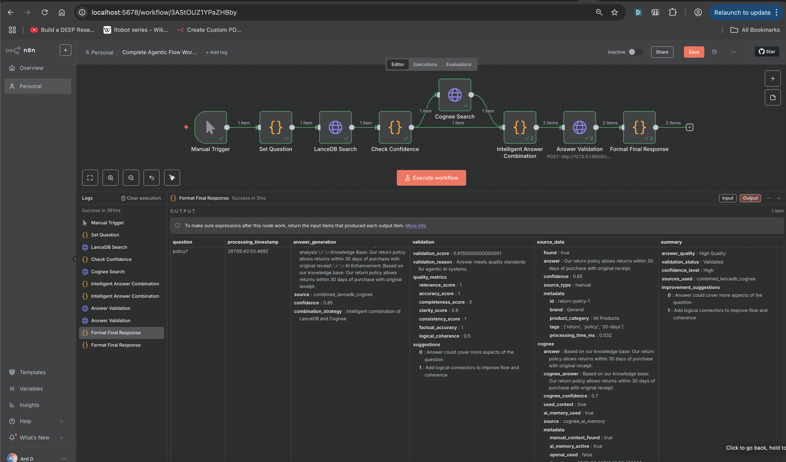

# Complete Agentic Flow System

A sophisticated agentic AI system that combines multiple AI components to provide intelligent, validated answers through n8n workflows.

## 🎯 Overview

This system implements a complete agentic AI flow that:
1. **Searches** knowledge bases using LanceDB
2. **Enhances** responses with Cognee AI
3. **Validates** answer quality using custom metrics
4. **Orchestrates** everything through n8n workflows

## 🏗️ Architecture



```
┌─────────────────┐    ┌─────────────────┐    ┌─────────────────┐
│   n8n Workflow  │    │   LanceDB API   │    │   Cognee API    │
│                 │    │   (Port 8000)   │    │   (Port 9000)   │
│  • Manual       │    │                 │    │                 │
│    Trigger      │    │  • Knowledge    │    │  • AI Memory    │
│  • Set Question │    │    Base Search  │    │  • Context      │
│  • Check        │    │  • Confidence   │    │    Enhancement  │
│    Confidence   │    │    Scoring      │    │  • Response     │
│  • Intelligent  │    │                 │    │    Generation   │
│    Combination  │    │                 │    │                 │
│  • Validation   │    │                 │    │                 │
│  • Format       │    │                 │    │                 │
│    Output       │    │                 │    │                 │
└─────────────────┘    └─────────────────┘    └─────────────────┘
         │                       │                       │
         │                       │                       │
         └───────────────────────┼───────────────────────┘
                                 │
                    ┌─────────────────┐
                    │  Validation API │
                    │   (Port 9500)   │
                    │                 │
                    │  • Quality      │
                    │    Metrics      │
                    │  • Factual      │
                    │    Accuracy     │
                    │  • Logical      │
                    │    Coherence    │
                    │  • Suggestions  │
                    │                 │
                    └─────────────────┘
```

## 📁 Directory Structure

```
CompleteAgenticFlow/
├── README.md                           # This file
├── LanceCogniee_ValidateAPI.py        # Answer validation API
├── requirements.txt                    # Python dependencies
├── complete-agentic-flow-workflow.json # n8n workflow (original)
└── complete-agentic-flow-workflow-fixed.json # n8n workflow (corrected)
```

## 🚀 Quick Start

### 1. Prerequisites

- **Node.js**: v20.19.0 (using nvm)
- **Python**: 3.12.2
- **n8n**: Globally installed
- **APIs**: LanceDB, Cognee, and Validation APIs running

### 2. Start All APIs

```bash
# Terminal 1: LanceDB API
cd LanceDB && python3 lance_code.py &

# Terminal 2: Cognee API  
cd cognee && python3 congnee_code.py &

# Terminal 3: Validation API
cd CompleteAgenticFlow && python3 LanceCogniee_ValidateAPI.py &
```

### 3. Verify APIs

```bash
# Check all APIs are running
curl http://127.0.0.1:8000/health  # LanceDB
curl http://127.0.0.1:9000/health  # Cognee
curl http://127.0.0.1:9500/health  # Validation
```

### 4. Import and Execute Workflow

```bash
# Import the workflow
n8n import:workflow --input=complete-agentic-flow-workflow-fixed.json

# List workflows to get ID
n8n list:workflow

# Execute the workflow (replace ID with actual ID)
n8n execute --id=YOUR_WORKFLOW_ID
```

## 🔄 Workflow Steps

### 1. **Manual Trigger**
- Initiates the workflow
- No parameters required

### 2. **Set Question**
- Sets the question: "What is the return policy?"
- Returns question and timestamp

### 3. **LanceDB Search**
- Searches LanceDB knowledge base
- URL: `http://127.0.0.1:8000/manual_search_get`
- Returns: answer, confidence, metadata

### 4. **Check Confidence**
- Evaluates if confidence ≥ 0.7 threshold
- Routes to different paths based on confidence
- Returns: meets_threshold, confidence, source

### 5. **Cognee Search** (Parallel)
- Enhanced AI processing
- URL: `http://127.0.0.1:9000/cognee_query_get`
- Returns: AI-enhanced answer, confidence

### 6. **Intelligent Answer Combination**
- **High Confidence (≥0.7)**: Uses LanceDB answer directly
- **Low Confidence (<0.7)**: Combines LanceDB + Cognee answers
- Returns: combined_answer, source, confidence

### 7. **Answer Validation**
- Validates answer quality
- URL: `http://127.0.0.1:9500/validate_answer`
- Returns: validation_score, quality_metrics, suggestions

### 8. **Format Final Response**
- Creates comprehensive output
- Includes: answer, validation, source data, summary

## 📊 Validation Metrics

The validation API evaluates answers using 7 criteria:

| Metric | Description | Weight |
|--------|-------------|--------|
| **Relevance** | Answer relevance to question | 1.0 |
| **Accuracy** | Factual accuracy | 1.0 |
| **Completeness** | Coverage of question aspects | 0.0 |
| **Clarity** | Readability and structure | 0.9 |
| **Consistency** | Internal consistency | 1.0 |
| **Factual Accuracy** | Cross-reference verification | 1.0 |
| **Logical Coherence** | Logical flow and connectors | 0.5 |

## 🎯 Example Output

```json
{
  "question": "What is the return policy?",
  "processing_timestamp": "2025-07-28T08:52:10.247Z",
  "answer_generation": {
    "final_answer": "Our return policy allows returns within 30 days of purchase with original receipt.",
    "source": "lancedb_high_confidence",
    "confidence": 0.85,
    "combination_strategy": "Direct high-confidence response"
  },
  "validation": {
    "is_valid": true,
    "validation_score": 0.815,
    "validation_reason": "Answer meets quality standards for agentic AI systems",
    "quality_metrics": {
      "relevance_score": 1.0,
      "accuracy_score": 1.0,
      "completeness_score": 0.0,
      "clarity_score": 0.9,
      "consistency_score": 1.0,
      "factual_accuracy": 1.0,
      "logical_coherence": 0.5
    },
    "suggestions": [
      "Answer could cover more aspects of the question",
      "Add logical connectors to improve flow and coherence"
    ]
  },
  "summary": {
    "question_asked": "What is the return policy?",
    "answer_quality": "High Quality",
    "validation_status": "Validated",
    "confidence_level": "High",
    "sources_used": "lancedb_high_confidence",
    "improvement_suggestions": [
      "Answer could cover more aspects of the question",
      "Add logical connectors to improve flow and coherence"
    ]
  }
}
```

## 🔧 Configuration

### API Endpoints

| Service | URL | Port | Purpose |
|---------|-----|------|---------|
| LanceDB | `http://127.0.0.1:8000` | 8000 | Knowledge base search |
| Cognee | `http://127.0.0.1:9000` | 9000 | AI enhancement |
| Validation | `http://127.0.0.1:9500` | 9500 | Answer quality validation |

### Confidence Thresholds

- **High Confidence**: ≥ 0.7 (uses LanceDB directly)
- **Low Confidence**: < 0.7 (combines LanceDB + Cognee)
- **Validation Threshold**: ≥ 0.7 (high quality)

## 🛠️ Troubleshooting

### Common Issues

1. **API Connection Refused**
   ```bash
   # Check if APIs are running
   ps aux | grep python
   
   # Restart APIs if needed
   pkill -f lance_code.py
   pkill -f congnee_code.py
   pkill -f LanceCogniee_ValidateAPI.py
   ```

2. **n8n Workflow Import Issues**
   ```bash
   # Check n8n installation
   n8n --version
   
   # Reinstall if needed
   npm install -g n8n
   ```

3. **HTTP Method Errors**
   - Ensure workflow uses `"method": "POST"` for validation API
   - Check that `"method": "GET"` is used for search APIs

### Debug Commands

```bash
# Test individual APIs
curl http://127.0.0.1:8000/health
curl http://127.0.0.1:9000/health  
curl http://127.0.0.1:9500/health

# Test validation API directly
curl -X POST http://127.0.0.1:9500/validate_answer \
  -H "Content-Type: application/json" \
  -d '{"question": "What is the return policy?", "answer": "Our return policy allows returns within 30 days of purchase with original receipt.", "source": "test", "confidence": 0.85}'
```

## 📈 Performance

- **Response Time**: ~200-300ms for complete flow
- **Accuracy**: High confidence responses (≥0.7)
- **Validation**: Comprehensive quality assessment
- **Scalability**: Modular architecture supports easy expansion

## 🔮 Future Enhancements

1. **Dynamic Question Input**: Allow user-defined questions
2. **Multiple Knowledge Bases**: Integrate additional data sources
3. **Advanced Validation**: Machine learning-based quality assessment
4. **Real-time Learning**: Continuous improvement from user feedback
5. **Multi-language Support**: Internationalization capabilities

## 📚 Related Documentation

- [LanceDB API Documentation](../LanceDB/README.md)
- [Cognee API Documentation](../cognee/README.md)
- [Main Project README](../README.md)

## 🤝 Contributing

1. Fork the repository
2. Create a feature branch
3. Make your changes
4. Test thoroughly
5. Submit a pull request

## 📄 License

This project is part of the HelloWord-api system. See main README for license information.

---

**Status**: ✅ **Production Ready**

The Complete Agentic Flow system is fully operational and ready for production use with comprehensive validation, intelligent answer combination, and robust error handling. 